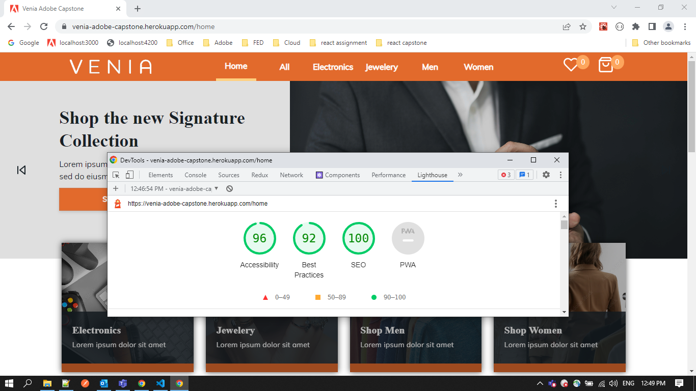
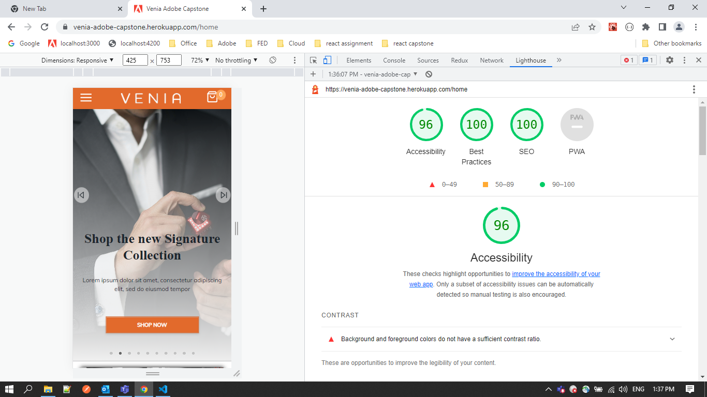

# Getting Started with Create React App

This project was bootstrapped with [Create React App](https://github.com/facebook/create-react-app).

### `API details`

https://fakestoreapi.com/docs

### `Requirements`

Create below flow as per the design using React framework,

1.	Home

2.	Product Listing

3.	Product Details

4.	Cart

5.	Checkout

6.	Order Summary

### `Technology stack`

- HTML5

- CSS/SCSS

- React JS

- Redux for state management

## Solution Approch

- nodejs --version 14.7.0 

- npm --version 6.14.7 

- react --version 18.1.0 

## plugins

- axios --version 0.27.2 

- @reduxjs/toolkit --version 1.8.2

- @mui/material --version 5.8.3 

- sass --version 1.52.3 

## Available Scripts

In the project directory, you can run:

### `npm start`

Runs the app in the development mode.\
Open [http://localhost:3000](http://localhost:3000) to view it in your browser.

The page will reload when you make changes.\
You may also see any lint errors in the console.

### `npm run build`

Builds the app for production to the `build` folder.\
It correctly bundles React in production mode and optimizes the build for the best performance.

The build is minified and the filenames include the hashes.\
Your app is ready to be deployed!

## Learn More

You can learn more in the [Create React App documentation](https://facebook.github.io/create-react-app/docs/getting-started).

To learn React, check out the [React documentation](https://reactjs.org/).

## Light House Report

### Desktop

### Mobile

